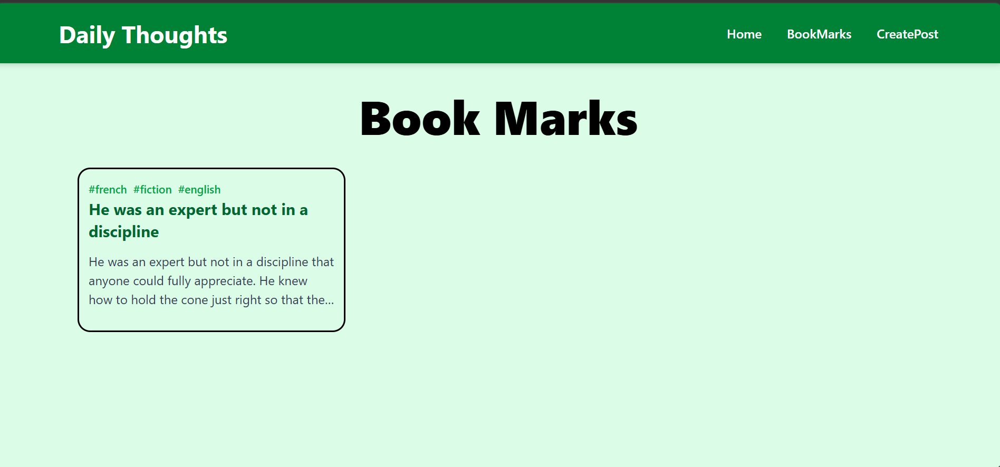
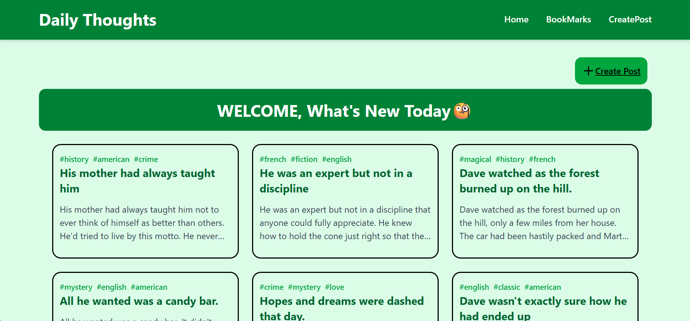
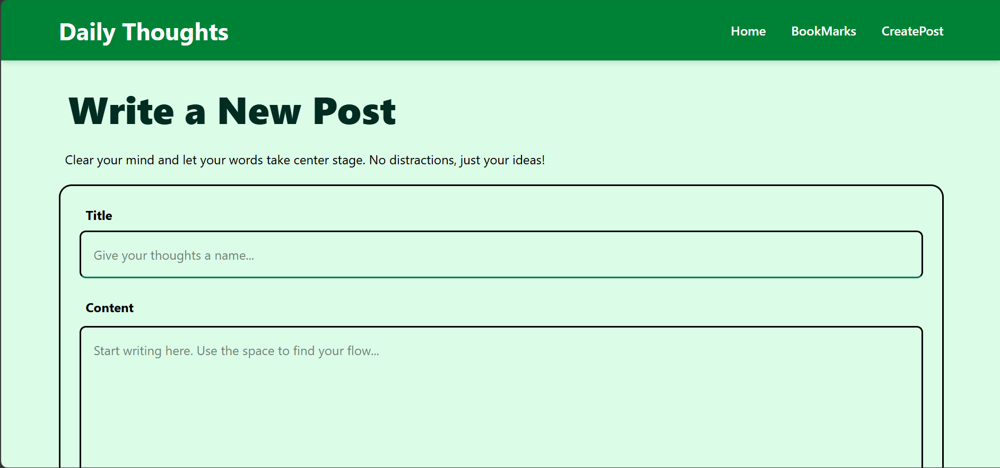
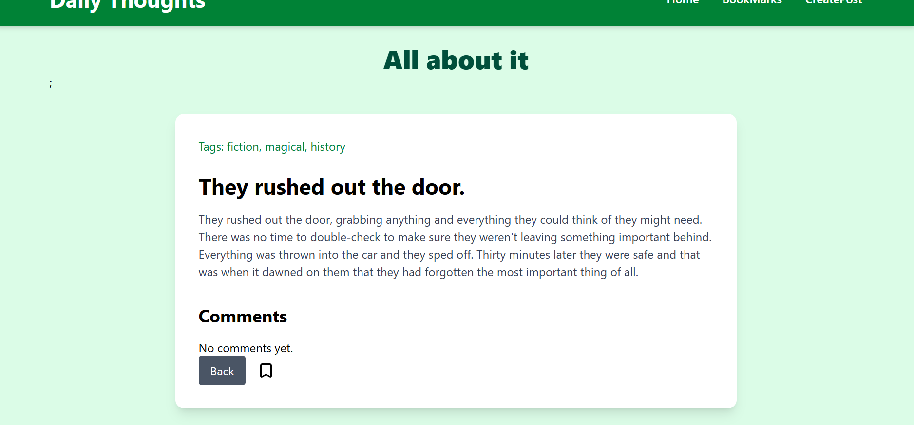

# Personal Blog App

A simple React blog application built as a project to practice the core concepts of React. The app allows users to browse blog posts, read individual posts, create their own posts, bookmark favorites, and view comments.

## Features

- Browse blog posts fetched from the DummyJSON API
- View full blog post details
- Read comments for each post
- Create your own blog posts (stored locally)
- Bookmark and unbookmark posts
- View all bookmarked posts
- Client-side routing with React Router
- Global bookmark state management using Jotai
- Responsive interface styled with Tailwind CSS

## Technologies Used

- React
- React Router DOM
- Jotai
- Tailwind CSS
- Lucide React Icons
- DummyJSON API

## Project Structure

```text
src/
├── atoms/
│   └── bookmarkAtoms.jsx
│
├── components/
│   ├── BlogCard.jsx
│   ├── BlogForm.jsx
│   └── Navbar.jsx
│
├── pages/
│   ├── Home.jsx
│   ├── BlogDetails.jsx
│   ├── CreatePost.jsx
│   └── BookMarks.jsx
│
├── App.jsx
└── main.jsx
|__ index.css
|__images
```

## API Endpoints

### Get Blog Posts

```text
https://dummyjson.com/posts?limit=10
```

### Get a Single Post

```text
https://dummyjson.com/posts/:id
```

### Get Comments for a Post

```text
https://dummyjson.com/comments/post/:id
```

## Pages

### Home

- Fetches and displays blog posts.
- Displays locally created posts alongside API posts.
- Clicking a card opens the blog details page.

### Blog Details

- Displays the selected blog post.
- Shows comments for the post.
- Allows users to bookmark or remove bookmarks.
- Includes a Back button to return to the Home page.

### Create Post

- Lets users create a new blog post.
- Performs basic validation.
- Saves posts locally using Local Storage.
- Redirects to the Home page after submission.

### Bookmarks

- Displays all bookmarked posts.
- Allows users to revisit their saved posts.

## Getting Started

1. Clone the repository.

```bash
git clone <repository-url>
```

2. Navigate to the project folder.

```bash
cd blog-app
```

3. Install dependencies.

```bash
npm install
```

4. Start the development server.

```bash
npm run dev
```

5. Open the application in your browser.

## What I Learned

Through this project I practiced:

- JSX and reusable components
- React Hooks (`useState` and `useEffect`)
- Props and component communication
- Event handling
- Conditional rendering
- Rendering lists using `.map()`
- React Router and dynamic routing
- Fetching data from APIs
- Managing global state with Jotai
- Using Local Storage to persist user-created posts and bookmarks
- Styling applications with Tailwind CSS

## screenshots






## Author

**Eman Mohammed**
